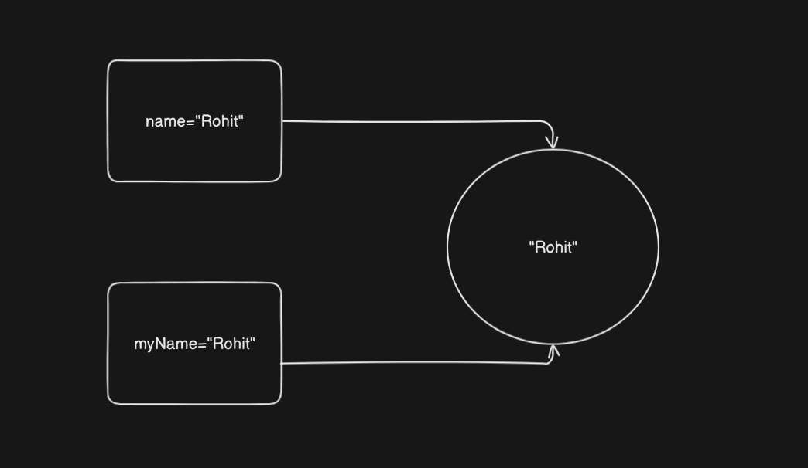

# Table of content
1. [Syllabus overview](#syllabus-overview)
2. [Installation process](#installation-process)
3. [Why Python language?](#why-python-language)
4. [Command line basics](#Windows-command-line-basics)
5. [Data types](#data-types)
6. [Operators](#operators)
7. [Variable assignments](#Variable-assignments)
	- [Rules for variable assignment](#valid-rules-for-naming-variables-in-python)
8. [Strings](#strings)
	- [Top 10 string methods](#top-10-string-methods)
	- [Print formatting with string](#print-formatting-with-string)
	- [Float formatting with f-string](#float-formatting-with-f-string)
9. [List](#list)
	- [Top 10 list methods](#top-10-list-methods)
10. [Dictionary](#dictionary)
	- [Top 6 dictionary methods](#top-10-dictionary-methods)

---
# Syllabus overview

1. Python 2 vs Python 3
2. Python installation
3. Environment selection
4. Jupyter notebook
5. Git & Github
6. Object & data structure basics
    - Numbers
    - Strings
    - List
    - Dictionary
    - Tuples
    - Files
    - Sets
    - Booleans
7. Comparison operator
    - Basic operators
    - Chained comparison operators
8. Python statement
    - `if`, `elif`, `else`
    - `for` loops
    - `while` loops
    - `range()`
    - List comprehension
9. Methods & functions
    - Methods
    - Functions
    - Lambda expressions
    - Nested statement
    - Scope
10. Create a game in python
11. OOP
    - Objects
    - Classes
    - Methods
    - Inheritance
    - Special methods
12. Error and exceptional handling
    - Error
    - Exception
    - try
    - except
    - finally
13. Create a more complex game in python
14. Modules & packages
    - Create modules
    - Installing modules
    - Exploring python ecosystem
15. Build in functions
    - `map`
    - `reduce`
    - `filter`
    - `zip`
    - `enumerate`
    - `all, any`
    - Complex
16. Decorators in python
17. Python generators
    - Iteration vs generation
    - Creating generators
18. Final capstone project
19. Advance bonus contents
    - Advance python modules
    - Advance python objects and data structure

---
# Installation process

## :desktop_computer: For windows:

#### Step 1: Download Python

1. Go to the official website: [https://www.python.org/downloads/](https://www.python.org/downloads/)
    
2. Click on the **Download Python 3.x.x** button (it detects your OS automatically).
#### Step 2: Run the Installer

1. Open the downloaded `.exe` file.
    
2. **Important**: Check the box that says **"Add Python to PATH"**.
    
3. Click **"Install Now"** (or choose "Customize Installation" if you want advanced options).
#### Step 3: Verify Installation

1. Open **Command Prompt**.
    
2. Type:
```python
python --version
```
or
```python
python3 --version
```
You should see something like:
```python
Python 3.12.0
```

## For macOS:

#### Step 1: Use the Official Installer (Recommended for Beginners)

1. Go to [https://www.python.org/downloads/mac-osx/](https://www.python.org/downloads/mac-osx/)
    
2. Download the latest `.pkg` installer.
    
3. Open it and follow the installation instructions.
    

#### Step 2: Add Python to PATH (if needed)

- macOS often includes Python, but it might be Python 2.x.
    
- Open **Terminal** and type:
```python
python3 --version
```
- If it’s not installed or outdated, consider using **Homebrew**:
#### Optional: Install with Homebrew (Advanced)
```python
/bin/bash -c "$(curl -fsSL https://raw.githubusercontent.com/Homebrew/install/HEAD/install.sh)"
brew install python
```

### **For Linux (Ubuntu/Debian)**

#### Step 1: Check if Python is Installed

- Open Terminal and type:
```python
python3 --version
```
#### Step 2: Install (if needed)
```python
sudo apt update
sudo apt install python3
```
### Step 3: Install pip (Python package manager)
```python
sudo apt install python3-pip
```

## ✅ **Post-Installation: Check Everything**

1. **Open terminal/command prompt**
    
2. Run:
```python
python --version
pip --version
```

---
# Virtual environment

## **Step 1:** Open your project folder

1. Launch `vs code`
2. Open the folder where you want to create the virtual environment:
	- `File`>`Open folder`
## **Step 2:**

1. Open `terminal`
## Windows:
```python
python -m venv venv
```
> This creates a folder named `venv` in your project directory

## **Step 3**: Activate the `virtual environment`

### Windows(CMD):
```python
venv\Scripts\activate
```
### Windows(Powershell):
```python
.\venv\Scripts\Activate.ps1
```
> After activation, your terminal prompt should show something like: `(venv)`

## **Step 4:** Select the Interpreter in VS Code

1. Press `Ctrl+Shift+P` to open Command Palette.
    
2. Type and select: `Python: Select Interpreter`
    
3. Choose the interpreter from the `.venv` folder, usually like:
```python
.\venv\Scripts\python.exe
```

## **Step 5:** Install Packages Inside the Virtual Environment

Once activated, use pip as usual:
```python
pip install flask
```
> Packages will install only inside the virtual environment.

---
# Why `python` language

**Python is a beginner-friendly and highly versatile programming language, making it easy to learn and implement across various domains.** From web development and automation to data science and machine learning, Python is used virtually everywhere. Its clean syntax and vast ecosystem of libraries make it suitable for both simple tasks and complex projects.

In real-life applications, Python can help you:

- **Organize your digital files**: Automatically sort documents, photos, videos, and other files into appropriate folders based on type, name, or creation date.
    
- **Automate repetitive tasks**: Clean temporary files, rename batches of files, or schedule regular backups of important data.
    
- **Build intelligent tools**: Create your own AI agents or chatbots using frameworks like `LangChain`, `OpenAI API`, or `Rasa`.
    
- **Detect faces or objects**: Use OpenCV to build face detection systems or security monitoring apps.
    
- **Scrape data from websites**: Collect product data, reviews, or prices from sites like Amazon or Flipkart using libraries like `BeautifulSoup`, `Scrapy`, or `Selenium`.
    
- **Analyze and visualize data**: Use `Pandas`, `NumPy`, and `Matplotlib` to process and visualize large datasets for insights and decision-making.
    
- **Create web apps**: Develop scalable web applications using frameworks like `Django` or `Flask`.
    
- **Develop games**: Use `Pygame` to build 2D games for learning and entertainment.
    
- **Build desktop applications**: Use `Tkinter`, `PyQt`, or `Kivy` to create user-friendly software interfaces.
    
- **Control IoT devices**: Integrate Python with Raspberry Pi to automate home appliances or build smart home solutions.
    
- **Automate browser actions**: Fill out forms, log into accounts, and perform web tasks with `Selenium` or `Playwright`.
    
- **Monitor stock prices or cryptocurrencies**: Pull real-time financial data and automate trading strategies.
    

For example, if your friend asks for a list of the best laptops under $5000, you can write a Python script to scrape laptop listings from Amazon or Flipkart, extract details like price, brand, and features, and save the results in an Excel file using the `openpyxl` or `pandas` library to share easily.

---
# Windows command line basics

## 🖥️ **1. Opening Command Prompt**

- Press `Win + R`, type `cmd`, and press `Enter`
    
- Or search “Command Prompt” from the Start menu

## 📁2. Navigation commands:

| Command | Description                                      |
| ------- | ------------------------------------------------ |
| `dir`   | Lists files and folders in the current directory |
| `cd`    | Changes directory (e.g., `cd foldername`)        |
| `cd ..` | Moves up one directory level                     |
| `cd \`  | Goes to the root directory                       |
| `cls`   | Clears the screen                                |
## 📂 3. Working with Files and Folders

| Command                    | Description                   |
| -------------------------- | ----------------------------- |
| `mkdir newfolder`          | Creates a new folder          |
| `rmdir foldername`         | Removes a folder (empty only) |
| `del filename.txt`         | Deletes a file                |
| `copy file1.txt file2.txt` | Copies file1 to file2         |
| `move file1.txt C:\Backup` | Moves a file to a folder      |
## ⚙️ 4.  Running Programs and Scripts

| Command         | Description                                    |
| --------------- | ---------------------------------------------- |
| `program.exe`   | Runs an executable (if in PATH or current dir) |
| `start notepad` | Opens Notepad                                  |
| `yourfile.bat`  | Runs a batch script                            |
| `exit`          | Closes the Command Prompt window               |

## 🔍 5. Helpful Tips

- Press **Tab** to auto-complete file or folder names.
    
- Use the **up/down arrow keys** to scroll through previous commands.
    
- Use `help` to get a list of available commands.

---
# Data types

| Name       | Type  | Description                                                            | Example                                                                                                                                                                                                   |
| ---------- | ----- | ---------------------------------------------------------------------- | --------------------------------------------------------------------------------------------------------------------------------------------------------------------------------------------------------- |
| Integer    | `int` | Whole number such as 1,2,3,4 etc. which doesn't hold any fraction part | ```<br>age=20<br>print(age) # Output: 20<br>print(type(age)) # Output: <class 'int'><br>```                                                                                                               |
| Float      | float | Fraction number such as 1.5, 10.0                                      | ```<br>height=10.5<br><br>print(height) # Output: 10.5<br><br>print(type(height)) # Output: <class 'float'><br>```                                                                                        |
| String     | str   | Collection of characters such as `Ramesh`, `Pooja`                     | ```<br>name="Pooja"<br><br>print(name) # Output: Pooja<br><br>print(type(name)) # Output: <class 'str'><br>```                                                                                            |
| List       | list  | Collection of homogeneous or heterogeneous data types.                 | ```<br>cities=["Mumbai", "Pune", 200, 100]<br><br>print(cities) # Output: ['Mumbai', 'Pune', 200, 100]<br><br>print(type(cities)) # Output: <class 'list'><br>```                                         |
| Dictionary | dict  | Unordered `key:value` pair.                                            | ```<br>cityWithPopulation={"Mumbai": 100, "Pune": 200}<br><br>print(cityWithPopulation) # Output: {'Mumbai': 100, 'Pune': 200}<br><br>print(type(cityWithPopulation)) # Output: <class 'dict'><br>```     |
| Tuples     | tup   | Order immutable sequence of objects.                                   | ```<br>cities=("Mumbai", "Pune", 100, 200)<br><br>print(cities) # Output: ('Mumbai', 'Pune', 100, 200)<br><br>print(type(cities)) # Output: <class 'tuple'><br>```                                        |
| Sets       | set   | Unordered collection of unique objects.                                | ```<br>alpha={"a", "b", "c", "c"}<br><br>print(alpha) # Output: {'a', 'b', 'c'}<br><br>print(type(alpha)) # Output: <class 'set'><br>```                                                                  |
| Booleans   | bool  | Logical value indicate `True` or `False`                               | ```<br>yes=True<br><br>no=False<br><br>print(yes) # Output: True<br><br>print(type(yes)) # Output: <class 'bool'><br><br>print(no) # Output: False<br><br>print(type(no)) # Output: <class 'bool'><br>``` |

---
# Operators

Operators are special symbols or keywords used to perform operations on variables and values.

|Operator|Description|Example|Output|
|---|---|---|---|
|`+`|Addition|`5 + 3`|`8`|
|`-`|Subtraction|`5 - 2`|`3`|
|`*`|Multiplication|`4 * 3`|`12`|
|`/`|Division (float)|`10 / 4`|`2.5`|
|`//`|Floor Division|`10 // 4`|`2`|
|`%`|Modulus (remainder)|`10 % 3`|`1`|
|`**`|Exponentiation|`2 ** 3`|`8`|

# Variable assignments

Variable assignments means assigning name, number, string to variable. For example, if you have name called _Rohit_ that means _Rohit_ name assigned to you when you get born. Similarly in programming language assigning value to variable useful for future use.

#### Example 1:
```python
name="Rohit"

age=21

weight=65.80

print("Name:", name)

print("Age:", age)

print("Weight:", weight)
```
#### Output:
```python
Name: Rohit
Age: 21
Weight: 65.8
```


*Diagram 1*

> When you assign particular value to 2 or more variable on that time single data reference is shared to that 2 variable instead of creating individual object. See above `Diagram 1`. To check reference number, you can use `id()` method.

#### Example:
```python
name="Rohit"

myName="Rohit"

print(id(name))

print(id(myName))
```
#### Output:
```python
2391358551936
2391358551936
```
---
# ✅ Valid Rules for Naming Variables in Python

1. **Must begin with a letter (A-Z, a-z) or an underscore `_`**
    
    - Examples: `name`, `_value`, `age1`
        
2. **Can contain letters, digits (0-9), and underscores**
    
    - Valid: `user_name`, `value1`, `x_2_y`
        
3. **Cannot start with a digit**
    
    - ❌ Invalid: `1name`, `3_value`
        
4. **Cannot be a Python keyword or reserved word**
    
    - ❌ Invalid: `class`, `def`, `for`, `if`, `while`, etc.
        
    - Use `import keyword; print(keyword.kwlist)` to see all keywords.
        
5. **Python is case-sensitive**
    
    - `score`, `Score`, and `SCORE` are three different variables.
        

---

#### ✅ **Best Practices (Conventions)**

- Use **lowercase letters** and **underscores** for readability (PEP 8 style guide):
```python
total_amount = 100
user_name = "Alice"
```
- Use **UPPER_CASE** for constants (by convention):
```python
MAX_USERS = 50
```

---
# Strings

String is collection of characters. It can your name, address, pet name etc. Written in single quote `''` or double quote `""`. For example `name='Ramesh'` or `name="Ramesh"`. Strings are ordered sequences so it can be accessed through indexing. Indexing start from `0` to `n-1`. Negative indexing also exist in python language. To access particular character from string you can use `[]` square brackets. For example `myName[0]`. `myName` variable contains `Rohit` string, if you print `myName[0]` this would result in  `R`, because `R` is stored at `0` index. If you give negative index like `-10`, `-20`, this would print character from back to front.

#### Example:
```python
myName="Rohit"

print(myName[0]) # Output: R

print(myName[1]) # Output: o

print(myName[2]) # Output: h

print(myName[3]) # Output: i

print(myName[4]) # Output: t

print(myName[5]) # Output: IndexError: string index out of range

print(myName[-1]) # Output: t

print(myName[-2]) # Output: i

print(myName[-3]) # Output: h

print(myName[-4]) # Output: o

print(myName[-5]) # Output: R

print(myName[-6]) # Output: IndexError: string index out of range

print(myName[0:3]) # Output: Roh

print(myName[1:4]) # Output: ohi

print(myName[2:5]) # Output: hit

print(myName[3:6]) # Output: it

print(myName[0:6]) # Output: Rohit

print(myName[0:7]) # Output: Rohit

print(myName[0:8]) # Output: Rohit

print(myName[0:9]) # Output: Rohit

print(myName[0:10]) # Output: Rohit

print(myName[0:11]) # Output: Rohit

print(myName[0:12]) # Output: Rohit

print(myName[0:13]) # Output: Rohit

print(myName[0:14]) # Output: Rohit
```

---
# Top 10 `String` methods

1. `upper()` Convert all characters into uppercase.
```python
name="rohit"
print(name.upper()) # Output: ROHIT
```
2. `lower()` Converts all characters in lower case.
```python
name="ROHIT"
print(name.lower()) # Output: rohit
```
3. `strip()` Removes leading(starting) & trailing(Ending) whitespaces.
```python
name="    Rohit    "
print(name.strip()) # Output: Rohit
```
4. `replace("old","new")` Replace all occurence of substring with another.
```python
name="Rohit"
print(name.replace("R","M")) # Output: Mohit
```
5. `split(separator)` Split the string into list of substring. `separator` can be`,`, `.`, ` `.
```python
name="Rohit,Sharma"
nameList=name.split(",")
print(nameList) # Output: ["Rohit", "Sharma"]
print(type(nameList)) # Output: <class 'list'>
```

6. `join(iterable)` Joins elements of an iterable into single string.
```python
source="D:/Country"
myFolderLocation="States"
fullPath="/".join([source, myFolderLocation])
print(fullPath) # Output: D:/Country/States
print(type(fullPath)) # Output: <class 'str'>
```

7. `find(substring)` Returns the lowest index where the substring is found, or `-1` if not found. If string contains `Rohit Roshan`, only first occurence of character's index value returned. You can see in the example.
```python
name="RohitRoshan"
print(name.find("R")) # Output: 0
print(name.find("d")) # Output: -1
```

8. `startswith(prefix)` Check if the string starts with a specified substring. It returns `boolean` value.
```python
name="Rohit"

print(name.startswith("R")) # Output: True

fullName="Rohit Sharma"

print(fullName.startswith("Rohit")) # Output: True

print(fullName.startswith("Sharma")) # Output: False

print(fullName.startswith("Rohit Sharma")) # Output: True

print(fullName.startswith("Roh")) # Output: True
```

9. `endswith(suffix)` Check if the string ends with a specified substring.
```python
name="Rohit"
print(name.endswith("t")) # Output: True
fullName="Rohit Sharma"
print(fullName.endswith("Rohit")) # Output: False
print(fullName.endswith("Sharma")) # Output: True
```

10. `isdigit()` Returns `True` if all characters in the string are **Digits**.
```python
age="20"
print(age.isdigit()) # Output: True
```

---
# Print formatting with string

```python
name="Rohit"
print(name) # Output: Rohit
```
In the above example just name being displayed; what if you wanna add `Hello Rohit` instead of `Rohit`? This done by `formating`. See the below example:
```python
name="Rohit"
print("Hello",name) # Output: Hello Rohit
```
Another way to do this (**recommended**):
```python
name="Rohit"
print(f"Hello {name}") # Output: Hello Rohit
```

>The `f` stands for **f-string**, which is short for **formatted string literal** — a powerful way to embed variables or expressions directly inside strings.

---
# Float formatting with f-string

You can control the **number of decimal places**, **alignment**, and more using **format specifiers** inside `{}`.

What's the answer of `12/7`? Answer is `1.714286`. This number is too long to print onto console, however you can crop it by following method and result would be `1.7142` or how much decimal point you want, it arbitrary choice.
